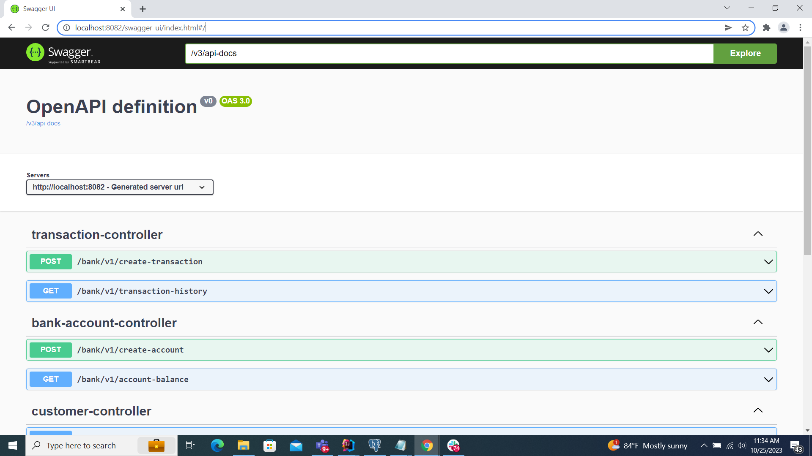

# bank-api

## introduction
* This apis are based on Bank Account and transaction activities
activities.

* Api has built using java 17, spring boot 3.1.5. PostgreSQL 14 used as database.

## Local Deployment
* To install java 17 and PostgreSQL
* To add `spring_profile_active=local` to environment variables
* create two databases for main and test and set up the `jdbc-url`, `username`, `password` according to created database in both `application-local.properties`
* `gradle bootRun` for local up
* `gradle test` for local test run
* then successful local up and running server is `localhost:8082`

## Rest Api

* for up and running application swagger-api doc can be found by below url
`http://{host}:8082/swagger-ui/index.html#/`
* 


### create new bank account for customers

```http
GET /bank/v1/create-account
```
#### Parameter
`no`

#### Request body
Json format should be below Schema
```
{
  "customerId": 0,
  "branch": "string",
  "country": "string",
  "bankName": "string",
  "accountType": "SAVING_ACCOUNT|CURRENT_ACCOUNT",
  "initialDepositAmount": 0,
  "accountName": "string"
}

```
sample valid Json
```
{
  "customerId": 3,
  "branch": "Walasmulla",
  "country": "Sri Lanka",
  "bankName": "EBC",
  "accountType": "SAVING_ACCOUNT",
  "initialDepositAmount": 3,
  "accountName": "Account B"
}
```
#### Server response

#### detail
Json format should be below Schema
```
{
  "id": 0,
  "accountId": "string",
  "customer": {
    "id": 0,
    "fistName": "string",
    "lastName": "string"
  },
  "branch": "string",
  "country": "string",
  "bank": "string",
  "accountType": "SAVING_ACCOUNT|CURRENT_ACCOUNT",
  "accountName": "string",
  "initialDeposit": 0,
  "accountBalance": 0,
  "savedBy": "string",
  "savedTime": 0
}
```
sample Json success response
```
{
  "id": 5,
  "accountId": "458182ae-8ba6-4892-b7c7-55b2930a5abd",
  "customer": {
    "id": 3,
    "fistName": "rhonda",
    "lastName": "church"
  },
  "branch": "Walasmulla",
  "country": "Sri Lanka",
  "bank": "EBC",
  "accountType": "SAVING_ACCOUNT",
  "accountName": "Account B",
  "initialDeposit": 3,
  "accountBalance": 3,
  "savedBy": "771f3cc4-c899-47a0-9edc-08f284707c0f",
  "savedTime": 1698163605754
}
```

##### status code
returns the following status codes in its API:

| Status Code | Description |
| :--- | :--- |
| 201 | `CREATED` |
| 400 | `BAD REQUEST` |
| 404 | `NOT FOUND` |
| 500 | `INTERNAL SERVER ERROR` |
---
### transfer amounts between customer accounts

```http
POST /bank/v1/create-transaction
```
#### Parameter
`no`

#### Request body
Json format should be below Schema
```
{
  "senderAccountId": "string",
  "amount": 0,
  "receiverAccountId": "string",
  "senderReference": "string",
  "transactionType": "DEPOSIT|WITHDRAW"
}
```
sample valid Json
```
{
  "senderAccountId": "458182ae-8ba6-4892-b7c7-55b2930a5abd",
  "amount": 1,
  "receiverAccountId": "bcc83703-839b-4daa-a405-a37d82a31a4d",
  "senderReference": "new transaction",
  "transactionType": "DEPOSIT"
}
```
#### Server response

#### detail
Json format should be below Schema
```
[
  {
    "transactionId": 0,
    "transactionAmount": 0,
    "transactionReference": "string",
    "transactionType": "DEPOSIT",
    "account": {
      "id": 0,
      "accountId": "string",
      "customer": {
        "id": 0,
        "fistName": "string",
        "lastName": "string"
      },
      "branch": "string",
      "country": "string",
      "bank": "string",
      "accountType": "SAVING_ACCOUNT|CURRENT_ACCOUNT",
      "accountName": "string",
      "initialDeposit": 0,
      "accountBalance": 0,
      "savedBy": "string",
      "savedTime": 0
    },
    "savedBy": "string",
    "savedTime": 0
  }
]
```
sample Json success response
```
[
  {
    "transactionId": 1,
    "transactionAmount": 1,
    "transactionReference": "new transaction",
    "transactionType": "WITHDRAW",
    "account": {
      "id": 5,
      "accountId": "458182ae-8ba6-4892-b7c7-55b2930a5abd",
      "customer": {
        "id": 3,
        "fistName": "rhonda",
        "lastName": "church"
      },
      "branch": "Walasmulla",
      "country": "Sri Lanka",
      "bank": "EBC",
      "accountType": "SAVING_ACCOUNT",
      "accountName": "Account B",
      "initialDeposit": 3,
      "accountBalance": 2,
      "savedBy": "771f3cc4-c899-47a0-9edc-08f284707c0f",
      "savedTime": 1698163605754
    },
    "savedBy": "5379284e-6a4e-4aa9-a073-6d71a3aacf77",
    "savedTime": 1698166430495
  },
  {
    "transactionId": 2,
    "transactionAmount": 1,
    "transactionReference": "new transaction",
    "transactionType": "DEPOSIT",
    "account": {
      "id": 4,
      "accountId": "bcc83703-839b-4daa-a405-a37d82a31a4d",
      "customer": {
        "id": 2,
        "fistName": "branden",
        "lastName": "gibson"
      },
      "branch": "Matara",
      "country": "Sri Lanka",
      "bank": "Abc",
      "accountType": "SAVING_ACCOUNT",
      "accountName": "Account A",
      "initialDeposit": 1,
      "accountBalance": 2,
      "savedBy": "3286359c-88c2-4df5-a351-83b24addf30a",
      "savedTime": 1698158618700
    },
    "savedBy": "a669cf66-ab15-4cbf-8df7-9f5db9bd5b6f",
    "savedTime": 1698166431149
  }
]
```

##### status code
returns the following status codes in its API:

| Status Code | Description |
| :--- | :--- |
| 201 | `CREATED` |
| 400 | `BAD REQUEST` |
| 404 | `NOT FOUND` |
| 500 | `INTERNAL SERVER ERROR` |
---
### retrieve transaction history for given account

```http
GET /bank/v1/transaction-history?account-id=bcc83703-839b-4daa-a405-a37d82a31a4d
```
#### Parameter
| Parameter    | Type | Description                   |
|:-------------| :--- |:------------------------------|
| `account-id` | `string` | **Required**. bank account Id |

#### Request body
`no`

#### Server response

#### detail
Json format should be below Schema
```
[
  {
    "transactionId": 0,
    "transactionAmount": 0,
    "transactionReference": "string",
    "transactionType": "DEPOSIT",
    "account": {
      "id": 0,
      "accountId": "string",
      "customer": {
        "id": 0,
        "fistName": "string",
        "lastName": "string"
      },
      "branch": "string",
      "country": "string",
      "bank": "string",
      "accountType": "SAVING_ACCOUNT|CURRENT_ACCOUNT",
      "accountName": "string",
      "initialDeposit": 0,
      "accountBalance": 0,
      "savedBy": "string",
      "savedTime": 0
    },
    "savedBy": "string",
    "savedTime": 0
  }
]
```
sample Json success response
```
[
  {
    "transactionId": 2,
    "transactionAmount": 1,
    "transactionReference": "new transaction",
    "transactionType": "DEPOSIT",
    "account": {
      "id": 4,
      "accountId": "bcc83703-839b-4daa-a405-a37d82a31a4d",
      "customer": {
        "id": 2,
        "fistName": "branden",
        "lastName": "gibson"
      },
      "branch": "Matara",
      "country": "Sri Lanka",
      "bank": "Abc",
      "accountType": "SAVING_ACCOUNT",
      "accountName": "Account A",
      "initialDeposit": 1,
      "accountBalance": 2,
      "savedBy": "3286359c-88c2-4df5-a351-83b24addf30a",
      "savedTime": 1698158618700
    },
    "savedBy": "a669cf66-ab15-4cbf-8df7-9f5db9bd5b6f",
    "savedTime": 1698166431149
  }
]
```

##### status code
returns the following status codes in its API:

| Status Code | Description             |
|:------------|:------------------------|
| 200         | `OK`                    |
| 400         | `BAD REQUEST`           |
| 404         | `NOT FOUND`             |
| 500         | `INTERNAL SERVER ERROR` |

---
### retrieve balance for given account

```http
GET /bank/v1/account-balance?account-id=bcc83703-839b-4daa-a405-a37d82a31a4d
```
#### Parameter
| Parameter    | Type | Description                   |
|:-------------| :--- |:------------------------------|
| `account-id` | `string` | **Required**. bank account Id |

#### Request body
`no`

#### Server response

#### detail
Json format should be below Schema
```
100.1
```
sample Json success response
```
2
```

##### status code
returns the following status codes in its API:

| Status Code | Description             |
|:------------|:------------------------|
| 200         | `OK`                    |
| 400         | `BAD REQUEST`           |
| 404         | `NOT FOUND`             |
| 500         | `INTERNAL SERVER ERROR` |
---
### populate all customer detail

```http
GET /bank/v1/customer-data
```
#### Parameter
`no`
#### Request body
`no`

#### Server response

#### detail
Json format should be below Schema
```
[
  {
    "id": 0,
    "name": "string"
  }
]
```
sample Json success response
```
[
  {
    "id": 1,
    "name": "arisha barron"
  },
  {
    "id": 2,
    "name": "branden gibson"
  },
  {
    "id": 3,
    "name": "rhonda church"
  },
  {
    "id": 4,
    "name": "georgia hazel"
  }
]
```

##### status code
returns the following status codes in its API:

| Status Code | Description             |
|:------------|:------------------------|
| 200         | `OK`                    |
| 400         | `BAD REQUEST`           |
| 404         | `NOT FOUND`             |
| 500         | `INTERNAL SERVER ERROR` |


